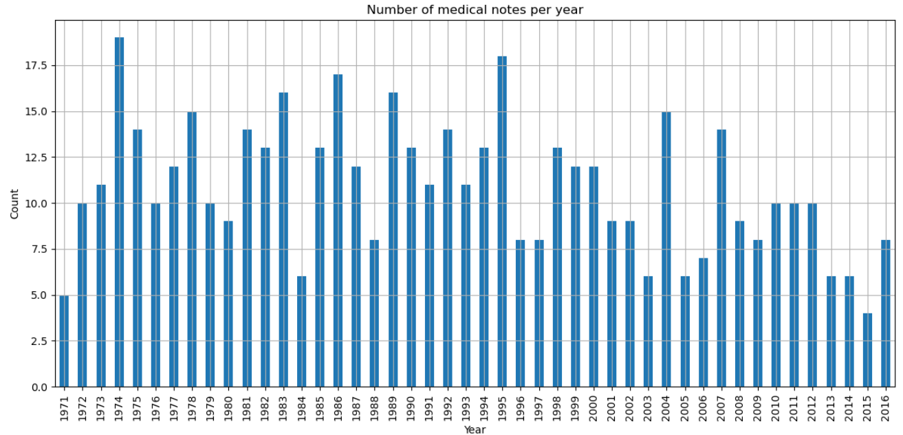

# 📅 Date Extraction and Normalization

This project extracts and normalizes messy medical note dates using regular expressions and Python.  
It handles multiple date formats, visualizes yearly counts, and provides sorted output in a readable file.

---

## ✨ Features
- ✅ **Flexible date extraction** (`mm/dd/yy`, `Mar 20 2009`, `20 March 2009`, `6/2008`, `2010`, …)  
- ✅ **Smart normalization** – fills in missing day/month and expands 2‑digit years to the 1900 s  
- ✅ **Chronological sorting** of the original 500 lines  
- ✅ **Report of unmatched lines** (`find_unmatched.py`)  
- ✅ **Plain‑text output** &nbsp;→&nbsp; `sorted_dates_output.txt`  
- ✅ **Year‑by‑year bar‑plot** saved as `images/year_distribution.png`  
- ✅ Interactive Jupyter notebook (`assignment1.ipynb`)  
- ✅ **Clean, modular code** in the `scripts/` folder  

---

## 🧠 Motivation
Medical notes often contain date information in inconsistent formats.  
A consistent, machine‑readable timeline is crucial for longitudinal analyses or ETL pipelines in healthcare analytics.  
This repo shows a pragmatic, regex‑driven approach that anyone can adapt.

---

## ▶️ Quick Start

```bash
# 1) Install dependencies
pip install pandas numpy matplotlib

# 2) Run main script
python date_extraction_project.py          # creates sorted_dates_output.txt + bar chart
```

---

## 🗄️ Project Layout
```
.
├── assets/
│   └── dates.txt                  # raw input (500 medical notes)
│
├── images/
│   └── year_distribution.png      # 📊 annual bar‑chart (auto‑generated)
│
├── scripts/
│   ├── extract_dates.py           # core extraction / sorting logic
│   └── find_unmatched.py          # helper for lines without a valid date
│
├── date_extraction_project.py     # single‑entry script
├── sorted_dates_output.txt        # output with line numbers + dates
├── README.md                      # you are here
└── LICENSE
```

---

## 🧪 Date‑Parsing Assumptions
| Situation | Interpreted as |
|-----------|----------------|
| `xx/xx/xx` | `mm/dd/yy` |
| 2‑digit year | 1900 + year (e.g. `4/5/79` → 1979) |
| Missing day | defaults to **1** (e.g. `6/2008` → 6 / 01 / 2008) |
| Missing month | defaults to **January** (e.g. `2009` → 01 / 01 / 2009) |

---

## 📊 Visualization

Below is a sample of the generated bar‑chart (one bar per year):



---

## 📤 Output File
`sorted_dates_output.txt` lists all 500 original lines **sorted by extracted date**, e.g.

```
  1. Line 9  : (4/10/71)Score-1Audit C Score Current:
  2. Line 84 : 5/18/71 Total time of visit (in minutes):
  ...
```

---

## 👤 Author
**Mukesh Thenraj**

---

## 📜 License
MIT – free for educational & non‑commercial use.
